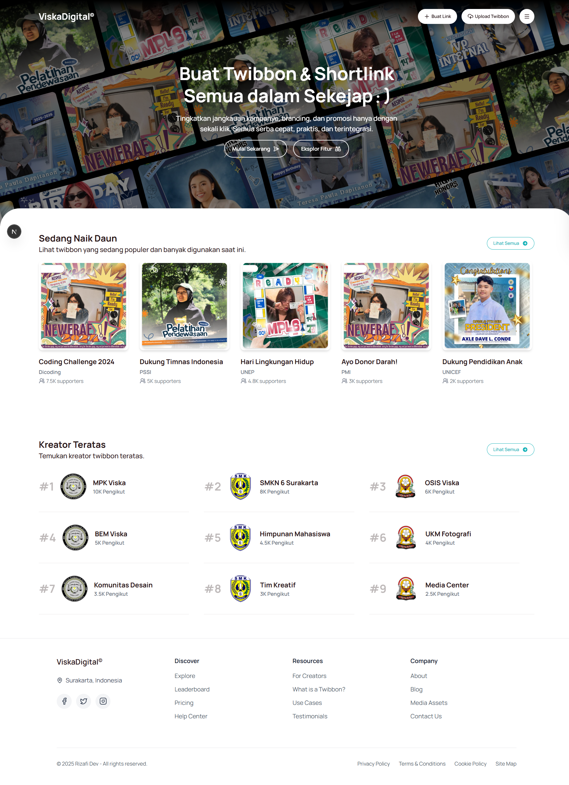
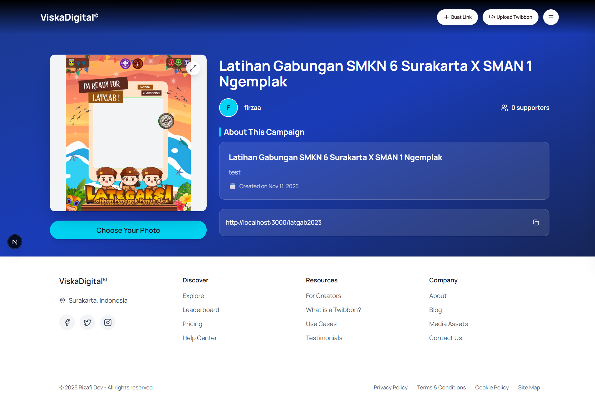
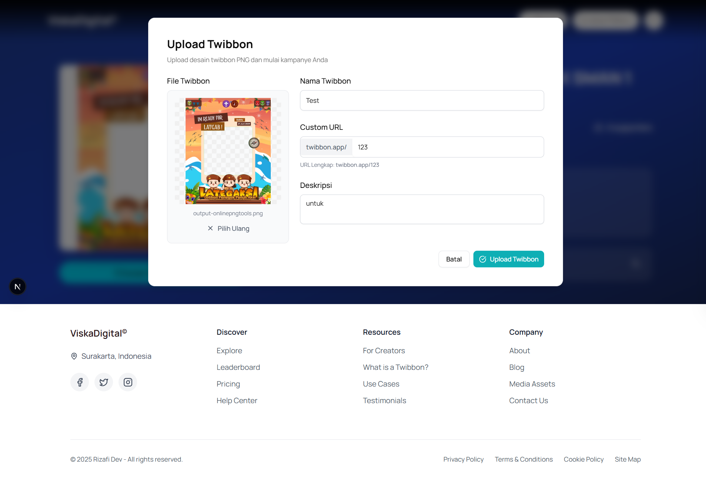
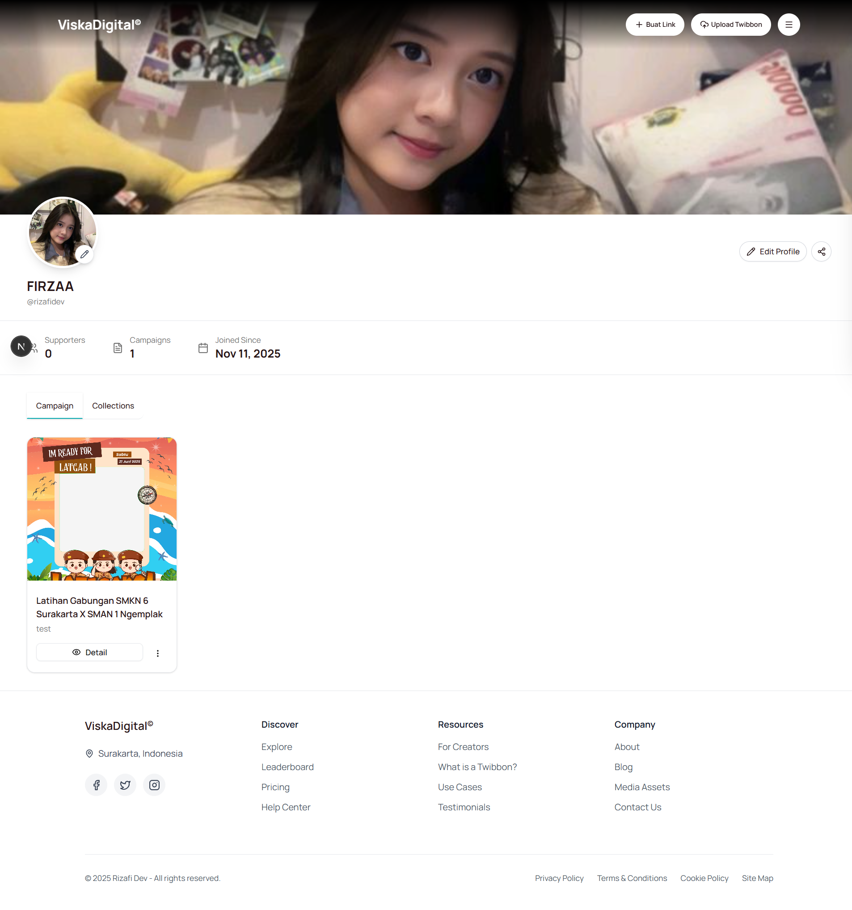
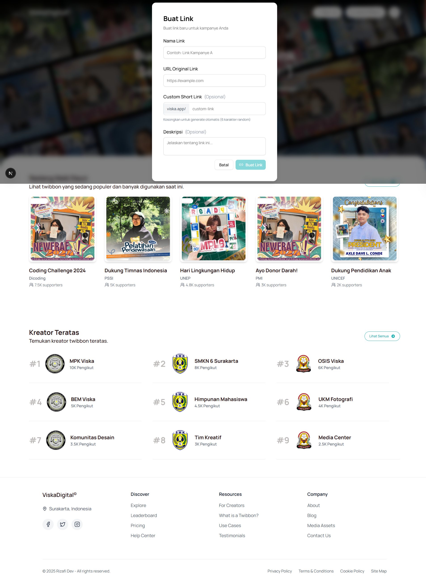

# ViskaDigital

ViskaDigital adalah platform web modern untuk membuat dan berbagi twibbon (campaign frame) serta URL shortener. Platform ini memungkinkan kreator untuk membuat campaign visual yang dapat digunakan oleh supporter dengan mudah.

## 📸 Screenshots

### Homepage



### Twibbon Detail Page



### Twibbon Editor



### User Profile



### Link Management



## ✨ Fitur Utama

### 🎨 Twibbon Creator

- **Upload & Create**: Upload frame twibbon dengan custom URL
- **Interactive Editor**: Edit foto dengan fitur drag, zoom (0.5x-3x), dan rotate
- **Real-time Preview**: Lihat hasil secara langsung sebelum download
- **High Quality Output**: Download hasil dalam resolusi tinggi sesuai ukuran asli twibbon
- **Campaign Management**: Kelola semua campaign twibbon Anda

### 🔗 URL Shortener

- **Custom Short Links**: Buat short link dengan custom alias
- **Click Analytics**: Track klik pada setiap link
- **Link Management**: Kelola dan edit link yang telah dibuat
- **Active/Inactive Toggle**: Kontrol status aktif link

### 👤 User Profile

- **Profile Customization**: Upload foto profil dan banner
- **Campaign Dashboard**: Lihat semua campaign yang telah dibuat
- **Statistics**: Monitor jumlah supporters dan campaign
- **Collections Tab**: Kelola koleksi link shortener

## 🛠️ Tech Stack

- **Framework**: Next.js 15.5.4 (App Router)
- **UI Library**: React 19
- **Styling**: Tailwind CSS 4
- **Component Library**: Radix UI
- **Backend & Auth**: Supabase
- **Storage**: Supabase Storage
- **Animations**: GSAP, Lenis
- **Icons**: Lucide React
- **Notifications**: Sonner

## 📁 Struktur Proyek

```
viskadigital/
├── app/                      # Next.js App Router
│   ├── profile/             # Halaman profil user
│   ├── twibbon/[url]/       # Halaman detail twibbon (dynamic route)
│   └── page.tsx             # Homepage
├── components/
│   ├── auth/                # Komponen autentikasi
│   ├── modal/               # Modal components (CreateLink, UploadTwibbon)
│   ├── profile/             # Komponen profil (Header, Stats, Tabs)
│   ├── twibbon/             # Komponen twibbon (Detail, Editor)
│   └── ui/                  # Reusable UI components
├── lib/
│   ├── auth/                # Auth hooks dan utilities
│   └── supabase/            # Supabase client & API functions
└── script/                  # Database setup scripts
```

## 🚀 Getting Started

### Prerequisites

- Node.js 20.x atau lebih baru
- Akun Supabase
- npm, yarn, pnpm, atau bun

### Installation

1. Clone repository

```bash
git clone https://github.com/Rizafii/ViskaDigital.git
cd ViskaDigital
```

2. Install dependencies

```bash
npm install
# atau
yarn install
# atau
pnpm install
```

3. Setup environment variables

Buat file `.env.local` di root folder:

```env
NEXT_PUBLIC_SUPABASE_URL=your_supabase_url
NEXT_PUBLIC_SUPABASE_ANON_KEY=your_supabase_anon_key
```

4. Setup Database

Jalankan SQL scripts di folder `script/` secara berurutan:

- `01-init-database.sql` - Membuat tabel
- `02-seed-roles.sql` - Insert roles
- `03-auth-trigger.sql` - Setup auth triggers
- `04-fixbug.sql` - Fixes
- `05-fixbug-trigger.sql` - Trigger fixes
- `06-storage-setup.sql` - Setup storage buckets
- `07-rls-policies.sql` - Row Level Security
- `08-banners-bucket-setup.sql` - Banner storage

Lihat `DATABASE-SETUP-GUIDE.md` dan `STORAGE-SETUP-GUIDE.md` untuk detail lengkap.

5. Run development server

```bash
npm run dev
# atau
yarn dev
# atau
pnpm dev
```

Buka [http://localhost:3000](http://localhost:3000) di browser.

## 📖 Fitur Detail

### Twibbon Editor

Twibbon editor menggunakan HTML5 Canvas untuk menggabungkan foto user dengan frame twibbon:

- **Drag to Position**: Geser foto untuk mengatur posisi
- **Zoom Control**: Slider dan tombol untuk zoom (0.5x - 3x)
- **Rotate**: Putar foto 90° setiap klik
- **Change Photo**: Ganti foto tanpa reset posisi
- **Download**: Export hasil dalam PNG berkualitas tinggi

### Database Schema

- `users` - Data user (linked ke auth.users)
- `role` - Role management (creator, user)
- `twibone` - Twibbon campaigns
- `twibone_used` - Track twibbon usage/supporters
- `link` - Short links
- `link_click` - Link analytics
- `creator_data` - Creator profile data (bio, photos)

### Storage Buckets

- `twibbons` - Twibbon frame images
- `profiles` - Profile photos
- `banners` - Profile banner images

## 🔐 Authentication

Menggunakan Supabase Authentication dengan:

- Email/Password authentication
- Row Level Security (RLS) policies
- Auto-create user record via database trigger
- Session management

## 📝 Documentation

- [Database Setup Guide](script/DATABASE-SETUP-GUIDE.md)
- [Storage Setup Guide](script/STORAGE-SETUP-GUIDE.md)
- [Link Integration](LINK-INTEGRATION.md)
- [Twibbon Integration](TWIBBON-INTEGRATION.md)

## 🤝 Contributing

Contributions, issues, dan feature requests sangat diterima!

1. Fork repository
2. Create feature branch (`git checkout -b feature/AmazingFeature`)
3. Commit changes (`git commit -m 'Add some AmazingFeature'`)
4. Push to branch (`git push origin feature/AmazingFeature`)
5. Open Pull Request

## 📄 License

This project is private and not licensed for public use.

## 👨‍💻 Developer

Developed by **Firmansyah Riza Afifudin**

## 🙏 Acknowledgments

- [Next.js](https://nextjs.org/)
- [Supabase](https://supabase.com/)
- [Radix UI](https://www.radix-ui.com/)
- [Tailwind CSS](https://tailwindcss.com/)
- [Lucide Icons](https://lucide.dev/)

---

Made with ❤️ by Firmansyah Riza Afifudin
